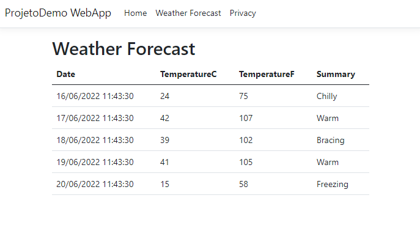

# ProjetoDemo

Demo project using dotnet core MVC application calling a rest API. This project will be published on Azure WebApp.



The rest api is very simple, just a method to return weather forecast.


## src folder
This folder contains all source files for application


- __ProjetoDemo.WebApi:__ dotnet 6 rest api
- __ProjetoDemo.WebApp:__ dotnet 6 web application (mvc)
- __ProjetoDemo.UnitTest:__ xunit test project

## iac folder
This folder contains the bicep files to create Azure environments

- __main.bicep:__ file for creating azure web app

To run the bicep file manually

```powershell
# set variables
$rgName = 'rg-MyProjectDemo'
$location ='eastus'
$skuName = 'S1'
$servicePlan = 'asp-MyProjectDemo'
$appName = 'wapp-MyProjectDemo-app'
$apiName = 'wapp-MyProjectDemo-api'

# login azure subscription
az login

# set the correct subscription
az account set --subscription 11111111-2222-3333-4444-55555555

# check the subscription
az account show

# create resource group
az group create --name $rgName --location $location

# running bicep file with parameters
az deployment group create `
    --resource-group $rgName `
    --template-file main.bicep `
    --parameters skuName=$skuName `
    servicePlan=$servicePlan `
    webAppName=$appName `
    webApiName=$apiName 
```
Go to the Azure portal and verify that the resources were created successfully.


# Contribute
Let me know and I'll be glad to invite you !!!, then ...

- Clone this repository: ```git clone https://github.com/lsprado/ProjetoDemo.git```
- Create your feature branch: ```git checkout -b features/my-new-feature```
- Commit your changes: ```git commit -am 'Add some feature'```
- Push to the branch: ```git push origin features/my-new-feature```
- Submit a pull request 😄